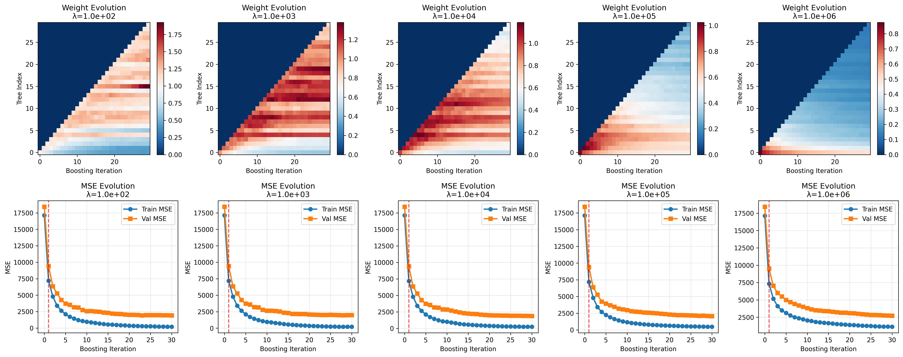
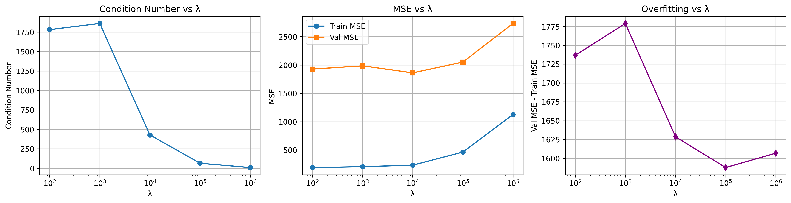
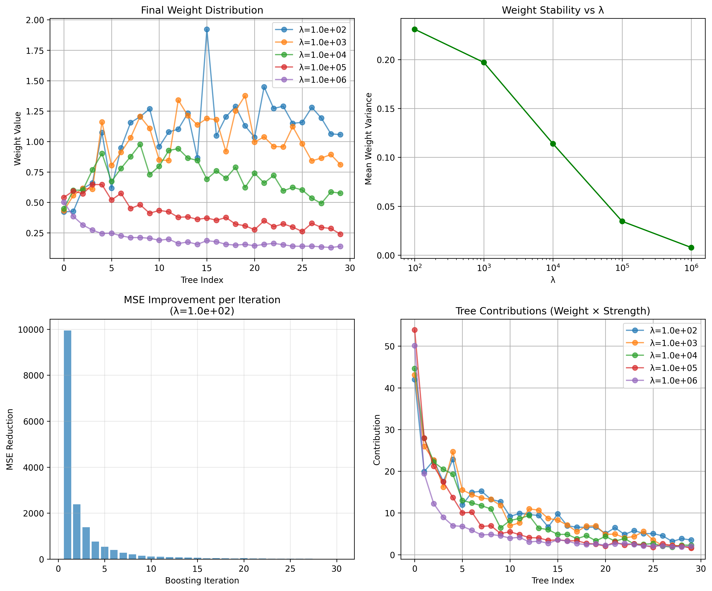

# Ridge Booster: Adaptive Tree Reweighting for Gradient Boosting

## Overview

Ridge Booster is a novel gradient boosting variant that uses ridge regression to adaptively determine optimal tree weights in ensemble models. Unlike traditional gradient boosting methods that rely on fixed learning rates or greedy weight updates, this approach solves for a globally optimal set of tree contributions, potentially increasing training efficiency while reducing hyperparameter sensitivity and manual tuning requirements.

### Traditional Gradient Boosting Background

Traditional gradient boosting regression models train a series of 'weak learners' to predict a dependent variable $Y \in \mathbb{R}$. Each weak learner represents a piecewise constant function $f(X)$ over the feature space $X \in \mathbb{R}^{N}$, partitioning it into $T$ regions such that $f(X): \mathbb{R}^{N} \rightarrow \{c_1, \ldots, c_T\}$ where $c_i$ is the constant prediction for the $i$-th partition (the mean over all values of $Y$ assigned to the $i$-th partition). Each weak learner is implemented as a decision tree of depth $2^{T}$ and builds these partitions through recursive binary splits of the feature space. The splitting conditions are determined by a variance reduction criterion. This criterion is greedy in the sense that it selects the splitting condition that is locally optimal at each node. The process to build the ensemble is as follows:

1. **Make an initial prediction** (e.g. zero or the mean of $Y$)
2. **Compute residuals**: $r_i = y_i - F_{t-1}(x_i)$ where $F_{t-1}$ is the current ensemble
3. **Fit weak learner**: Train tree $f_t(x)$ to predict residuals $r_i$.
4. **Update ensemble**: $F_t(x) = F_{t-1}(x) + \eta \cdot f_t(x)$
5. **Repeat steps 2-4 until stopping criterion is reached**

The learning rate $\eta$ is typically fixed (e.g., 0.1) and chosen a priori or through manual hyperparameter tuning. This approach treats each tree's contribution as predetermined by the learning rate, regardless of the tree's actual predictive value.

### Ridge Booster Mathematical Formulation

Ridge Booster departs from this fixed-weight approach by solving for optimal tree contributions globally. At iteration T, the series of model predictions is:
$\sum_{i=1}^{N} y_i^{(T)} = \sum_{i=1}^{N} \sum_{t=1}^{T} \omega_t f_t(x_i)$

Instead of using fixed weights, Ridge Booster solves the regularized optimization problem:
$L(\omega) = \\sum_{i=1}^{N}| y_i - \sum_{t=1}^{T} \omega_t f_t(x_i)\|^2 + \lambda \|\omega\|^2$

The optimal weights are found via:
$\omega = (F^{\top}F + \lambda I)^{-1}F^{\top}y$

where $F \in \mathcal{R}^{N \times T}$ is the matrix of tree predictions.

### Implementation Variants

**Closed-form Ridge Solution**: Direct matrix inversion for exact optimization
**Greedy Reweighting**: Independent weight optimization using scipy.optimize.minimize  
**Conjugate Gradient Approximation**: Numerically stable alternative using iterative CG solver

## Methodology Summary
The ridge booster specification was implemented in Python. Various Python scripts were used to generate data and figures for analysis. A benchmarking program compared the ridge booster's performance to a control booster (sklearn's [DecisionTreeRegressor](https://scikit-learn.org/stable/modules/generated/sklearn.tree.DecisionTreeRegressor.html) with a fixed learning rate hyperparameter) on several standard regression datasets provided by sklearn (a real-world [california housing dataset](https://github.com/scikit-learn/scikit-learn/blob/b24c328a30/sklearn/datasets/_california_housing.py#L56) and various [synthetic regression datasets](https://scikit-learn.org/stable/modules/generated/sklearn.datasets.make_regression.html)). The competing algorithms were compared with respect to a variety of performance metrics. These included mean square error (MSE), overfitting (validation MSE - training MSE), and training time.

In addition to these comparative metrics, some of the ridge booster's distinct properties were considered in isolation. Matrix condition number analysis was performed specifically on the ridge booster to assess its numerical stability. Moreover, the ridge booster implementation saved full histories of its weight updates and ensemble predictions. These histories were used to gain insights on the stability of the weight updates and how the training process negotiated the bias-variance tradeoff.

## Empirical Results

### Synthetic Dataset Performance


### California Housing Dataset Performance  


### Results of Noise Analysis 


### Weight and MSE Evolution


### Lambda Performance Curves


### Post-Training Details


## Key Findings and Limitations

- **Reduced sensitivity of MSE to hyperparameter choices**: Ridge variants (purple/orange lines) show flatter validation curves compared to Fixed LR, indicating less sensitivity to hyperparameter selection
- **Comparable best-case accuracy**: Ridge CG achieves MSE of 0.287 vs Fixed LR's 0.270 on California housing, and MSE of 1610 vs Fixed LR's 1651 on the synthetic dataset, demonstrating competitive best-case accuracy.
- **Improved convergence under certain conditions**: Ridge variants show faster initial learning on datasets with low noise (roughly speaking, this means a Gaussian noise process with a standard deviation under 100), reaching lower MSE in fewer iterations.
- **Training efficiency**: In addition to the faster convergence mentioned above, ridge methods achieve comparable training times for the same number of iterations (1.17-1.32s) to traditional approaches while requiring less hyperparameter tuning and requiring fewer iterations to achieve lower MSE values. 
- **Computational complexity**: Solving the ridge system involves matrix operations that scale as O(T²) in memory and O(T³) in computation, making the method impractical for very large ensembles (loosely > 1000 trees)
- **Least-squares regression only**: Current formulation applies to regression problems but not classification problems. It also assumes a loss function with a quadratic form.
- **Numerical instability**: Closed-form solution sensitive to ill-conditioned matrices (theoretically mitigated by CG variant). However, this effect hasn't been observed in practice. Empirical results suggest that numerical stability is not the primary limitation with respect to MSE performance: the conjugate gradient approximation did not meaningfully improve model accuracy but maintained similar MSE performance to the closed-form variant. 
- **Vulnerability to Noisy Datasets**
Empirical testing on synthetic data shows a fixed learning rate 'control' booster performing better than the experimental ridge booster on noisy data. As a Gaussian noise parameter was scaled up on a synthetic dataset, the control booster outperformed the experimental booster in terms of average-case MSE, worse-case MSE, and overfitting (validation MSE - training MSE) (crossover point is around a standard deviation of 100).

In summary, empirical results and theoretical considerations indicate that the ridge booster has a narrower operating regime than traditional gradient boosting, but that it can significantly outperform traditional fixed-rate boosting within that regime. 

## Applications

This methodology could benefit:
- **Regression Analysis** on datasets with suitable properties (e.g. noise with std < 100, < 1000 iterations needed to converge)
- **Research applications** exploring adaptive ensemble methods
- **Automated ML pipelines** where manual hyperparameter tuning is impractical and datasets have suitable properties

## Technical Implementation
- **Language**: Python
- **Key Libraries**: NumPy, Scikit-learn, SciPy
- **Evaluation**: Custom benchmarking framework comparing multiple boosting variants
- **Datasets**: Synthetic regression data (sklearn.make_regression) and California Housing dataset

## Repository Structure

```
ridge-booster/
├── src/
│   ├── ridge_booster.py       # Core algorithm implementation
│   ├── boosting_comparison.py # Evaluation framework
│   └── noise_analysis.py # for analyzing variance effects in training+test data
├── data/
│   └── images/               # Experimental outputs
└── README.md                  # This document
```

## Future Directions
- Theoretical convergence analysis for CG approximation
- More rigorous hypothesis testing
- Test on more real-world datasets
- Early stopping criteria to decrease training time and/or reduce overfitting
---